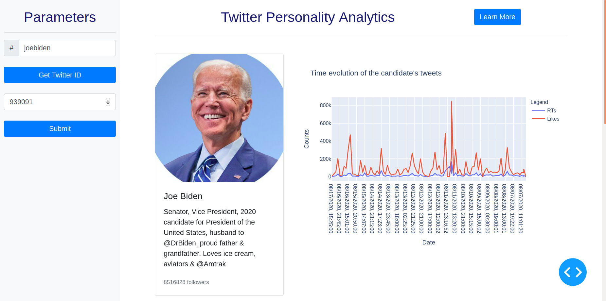
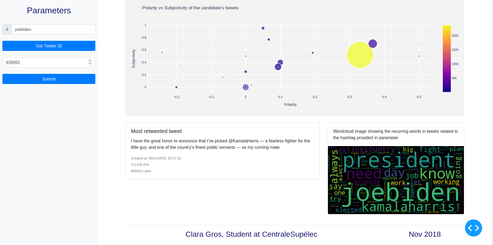

# Opinion analysis in Twitter

This `README.md` contains a short description of the project and some required instructions for configuring and running the application in the deployment phase.

## Objective

The objective of this mini application is to develop a system to analyze opinions about a person, an event, a brand in tweets. The example given in this project is an application of opinions on a political personality. Through this project, you will discover the python ecosystem to work with Twitter, do text data analysis and create dashboards through the Dash framework.

The MVP (Minimum Viable Product) of this project will consist in delivering a first version of the end-to-end analysis tool, i.e. from data collection to sentiment prediction and its visualization with simple solutions as shown below.




In particular, the MVP :
* Will allow to connect to the Twitter API to collect a set of tweets related to an entity.
* Will be based solely on the analysis of the textual content of the tweets and will neglect information about the author of the tweet, its type (retweet, reply, ...) and its multimedia content.
* Will allow simple processing and analysis of tweets.
* Display the results of the analysis in the form of a time graph as above in a dashboard running on localhost.

## App configuration

This project is based on version 3 of python.

### Create a virtual environment

In the root folder `/`, create a virtual environment runnning the command:
```
python3 -m venv env
```

To activate the virtual environement:
```
source env/bin/activate
```

Then install your pip dependencies:
```
pip install -r requirements.txt
```

To exit the virtual environement, `CTRL+d` or run:
```
deactivate
```

### Download necessary packages

In addition to the librairies to install in the `requirements.txt` file, you will need to install `nltk` packages to enable tweets language analysis. To do so, please execute the following command in a shell. It will download the following package to the directory `~/nltk_data`.

```
python
import nltk
nltk.download('punkt')
nltk.download('stopwords')
nltk.download('wordnet')
```

### Access the Twitter API

To connect to the Twitter API, you must first create a Twitter account if you don't have one, as it is required to access the API.

After having created your account, go to the [application management portal](https://developer.twitter.com/en/apps) to request a `developer` account and create an `app`. To facilitate the use of the Twitter API in the academic context, the procedure is made easier by creating an academic group. To do this, you will need to make a list of the Twitter credentials of the different people in a group to add you to this group.

Below is an example of how to fill the form to create the app

#### Example

##### App Name

cs_week_twitter_2019

##### Description

Academic Project in the context of a programming course

##### Website URL

https://gitlab.com/-/ide/project/grosclara/twitterpredictor/

##### Sign in with Twitter

Disabled

##### Organization name

CentraleSupélec

##### Organization website URL

https://www.centralesupelec.fr/

##### App usage

This app will just be used to collect some tweet related to a specific event in order to build an application of opinion mining. This is in the context of an academic activity that aims at giving students some skills in programming and data science such as :

 + using versonning
 + building an application from scratch
 + using apis
 + using the data science python framework

### Setup environment variables

In the `/tweet_collection` package, create a `credentials.py` file that will contain our local variables. The `credentials.py` file should look like this :

`/tweet_collection/credentials.py` file

```python
# Twitter App access keys for @grosclara

#Consume:
CONSUMER_KEY='my-api-key'
CONSUMER_SECRET='my-api-secret-key'

#Access:
ACCESS_TOKEN='my-access-token'
ACCESS_SECRET='my-secret-access-token'
```

The `CONSUMER_KEY` (API Key), `CONSUMER_SECRET` (API Secret Key), `ACCESS_TOKEN` and `ACCESS_SECRET` variables must match the corresponding values of the Twitter credentials of the app you have just created. 

**Warning, this file should never be pushed on your git repository (neither local nor remote)**

## Run the app

To run the app, run the following command. Make sure your virtual environment is activated.

```
python app.py
```

It will start the Dash web app running on your local laptop. You can then visit the url https://localhost:8050 (port might be different) to interact with the application. For example, you can enter *joebiden* in the `Hashtag` field and *939091* (Biden Twitter ID) in the ID field before clicking on the submit button to see the result. Careful, displaying the results can take quite some time dependnig on your connexion beacuse of the numerous API calls.

